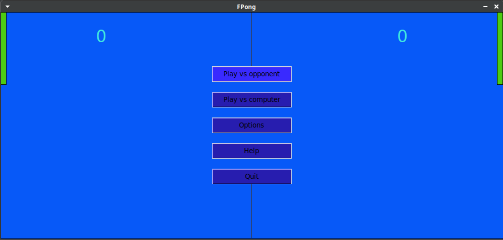
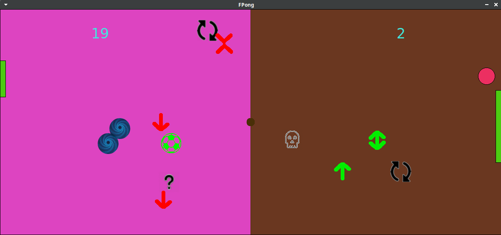

## Basic info

Welcome to the F(unny)Pong

Controls: left player - W/S, right - key Up/Down
When playing against bot you are on the right
At the time of game you could press Esc to go to the menu

There are 5 modes: Classic, Soft, Normal, Best, Hard
* Classic - Without buffs
* Soft - Sometimes minor buffs appear(Speed_up, Slow_down, Enlarge, Shrink)(all about pad)
* Normal - Buffs pops up more frequently, and to previous list added (Small_ball, Big_ball, Random)
* Best - Frequency increases, added (Rotate, Die) \
Maybe I played this game so many times(while debugging) so that all the previous modes became boring.
Note: \<Best\> is the best - In My Humble Opinion
* Hard - Added (Teleport, Splash, Move)

Note: in most cases buffs affect the player who touched the ball last \
Except some general (Small_ball, Big_ball, Teleport, Move)

Some non-intuitive buffs:
* Random - (question mark) execute random buff
* Rotate - (two rounded arrows) change pad control keys (when you press Up, it moves down) and color to dark-green
* Teleport - (spirals) change balls position
* Splash - (white, green, red, black stripes) Cause blinking in your area
* Move - (four arrows) Screen moves several times

## Installation

There is no need to install additional packages! Just pure python3 with tkinter

## Screenshots

